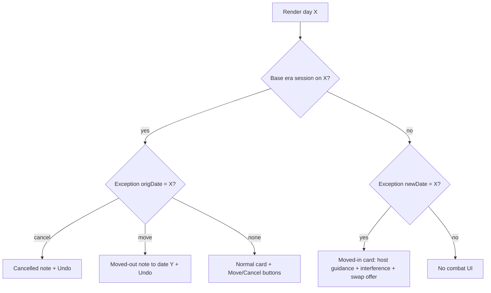

# FitUp Combat Flexibility Layer — Implementation Plan (v2)

**Goal**: On top of the shipped Combat Integration v1 (fixed weekly class days + era permutations), add a **one-off flexibility layer**: move or cancel any specific class instance (e.g. this Monday's class → Wednesday), with **muscle-aware interference logic per session type**, **time-of-day cardio prescription** (evening class 18:00+ → run in the morning ~05:00, ≥6h separation), and **warm-up guidance content** answering what is allowed before/inside a combat class.

**Confirmed decisions (user)**:
1. **Advisory + smart suggestions** — warn on interference, suggest best move target, offer one-tap swap via the existing swap engine. NEVER auto-change strength volume (progression engine guarantees stay intact).
2. **Class-time input per class day** (default 18:00) drives a computed morning cardio window; **moves allowed to any future date** within the plan horizon.
3. Session-type logging (technique/pads/bag/sparring/clinch/mixed) drives muscle-specific guidance.

---

## 1. Current Architecture Facts (verified)

| Fact | Location | Consequence for v2 |
|---|---|---|
| v1 shipped: era optimizer, era-aware seeding, combat card, badges, settings, i18n ×3 | `js/combat-scheduler.js`, `js/db.js` `resolvePlanSource()` L243 / `applyCombatSchedule()` L369, `js/today.js` `renderCombatCard()` L2441, `js/calendar.js` `combatBadgeFor()` L21, `js/app.js` L863+ | v2 layers ON TOP; no change to era/seed logic |
| PLAN record `date` is `DD/MM/YYYY` | `js/db.js` `buildPlanDay()` L300 | Exceptions keyed by ISO `YYYY-MM-DD`; single conversion helper pair, unit-tested |
| TRACKING keyed by dayIndex; `tracking.combat = { done, skipped, kind, rpe, ts }` | `js/db.js` `saveDayTracking()` L440, `js/today.js` `markCombatDone()` L2553 | Add `sessionType` field; no schema migration needed |
| Swap engine swaps PLAN content + TRACKING between two dayIndexes | `js/db.js` `swapWorkouts()` L709, `js/today.js` `performSwap()` L4281 | One-tap swap suggestion reuses it verbatim |
| `isDayEditable()`: today+past always editable; future only if `unlockedEarly` | `js/today.js` L3214 | Move/Cancel are FUTURE-oriented exception-layer actions → allowed on today+future regardless of `unlockedEarly` (they never mutate PLAN/TRACKING). Mark-done stays gated as today |
| Settings ride CloudSync + JSON backup automatically | `js/app.js`, `js/cloud-sync.js` | New `combatExceptions` setting syncs/backups for free |
| Boot consistency check compares `combatSchedule.rev` vs `combatAppliedRev` → re-applies eras | `js/app.js` L349–363 | Exceptions need NO re-seed (pure render layer) → zero plan-integrity risk |
| Era appended on EVERY settings save | `js/app.js` save handler L1132–1141 | BUG-RISK: adding classTimes must not append eras → guard: append era only when permutation-relevant fields changed (classDays/practice/hardClass/enabled) |
| Notification: evening encouragement after 17:00 | `js/notifications.js` L91–94 | Extend text on class days with class time + morning-run reminder |
| sw cache `fitup-v170-...`, precaches combat-scheduler | `sw.js` L1 | Bump to v171 |

---

## 2. Feature Design

### 2.1 Data model — new SETTINGS key `combatExceptions`

Separate setting (NOT inside `combatSchedule`) so exception edits never bump the era rev and never trigger plan re-seeds:

```js
{
  rev: 3,                          // bumped on every mutation (sync conflict marker)
  items: [
    {
      id: 'x-1728570000000',
      kind: 'class1' | 'class2',   // classes only; practice keeps its Skip button
      origDate: '2026-10-12',      // ISO date the session was originally scheduled
      action: 'move' | 'cancel',
      newDate: '2026-10-14',       // ISO, moves only
      sessionType: 'sparring',     // optional: technique|pads|bag|sparring|clinch|mixed
      time: '19:00',               // optional per-instance class time override
      note: '',
      ts: '2026-10-10T12:00:00.000Z'
    }
  ]
}
```

**Invariants** (enforced at creation, verified by tests):
- At most one exception per `(kind, origDate)`; re-editing replaces the item; Undo = remove item.
- At most ONE combat session per calendar date: a move target that already hosts a base-era session, a moved-in session, or a non-cancelled practice → **blocked** with conflict message + next-best suggestion.
- `newDate >= today` and within plan horizon (560 days); `origDate >= today` for creation (past sessions use existing Skip/Done).
- Prune: on every save, drop items whose relevant dates are older than today − 30d (tracking.combat already holds the historical truth).
- Chained moves (move of a moved-in session): allowed — new item keyed by the moved-in date as `origDate`; resolver applies items in `ts` order, max 5 hops (cycle guard).

### 2.2 Muscle-aware interference engine (pure, in `js/combat-scheduler.js`)

```js
SESSION_PROFILES = {           // load 1-5, cns 1-5, muscle fatigue units 0-3
  technique: { load:1, cns:1, muscles:{ hips:1, core:1 } },
  bag:       { load:2, cns:2, muscles:{ wrists:2, forearms:2, shoulders:2, calves:1 } },
  pads:      { load:3, cns:3, muscles:{ shoulders:3, triceps:2, core:2, calves:2 } },
  sparring:  { load:4, cns:4, muscles:{ shoulders:3, core:3, neck:2, calves:2, grip:2 } },
  clinch:    { load:4, cns:3, muscles:{ grip:3, forearms:3, neck:3, core:2, lumbar:2 } },
  mixed:     { load:3, cns:3, muscles:{ shoulders:2, grip:2, core:2, calves:2 } }
}
DAYTYPE_MUSCLES = {
  pull:{ grip:3, forearms:2, lats:2, biceps:2 }, push:{ shoulders:3, triceps:3, chest:2 },
  legs:{ quads:3, glutes:3, calves:2, core:1 }, zone2:{ calves:1 }, vo2:{ calves:2, quads:1 },
  recovery:{}, rest:{}
}
```

`sessionInterference(sessionType, hostDayType, prevDayType, nextDayType)` → `{ level: 'ok'|'caution'|'high', reasons: [keys] }`:
- overlap = Σ min(session.muscles[m], daytype.muscles[m]) per shared muscle
- Moved-in ONTO a strength day: overlap ≥ 4 or load ≥ 3 → `high` (guidance: keep class technique-only) + one-tap swap suggestion
- Day AFTER session hosts Pull and session grip ≥ 2 → `grip_before_pull` caution/high (towel hang, pull-ups)
- Day AFTER session hosts Push and session shoulders ≥ 2 → `shoulders_before_push` caution
- Sparring/clinch day-before ANY strength → `cns_before_strength` caution
- Session on Rest day → `rest_eroded` caution; adjacent to another session → `sessions_adjacent` caution
- clinch always carries the existing lumbar-disc safety footer
- Unknown sessionType → assume `mixed` (conservative)

`suggestMoveTargets(state, origDate, kind, sessionType, horizonDays=21)` → ranked candidates `{ date, dayType, level, reasons, cost, best }`:
- Excludes: past dates, dates already hosting a session (invariant), dates beyond plan horizon
- cost = interference cost (reuse v1 COST matrix values + profile overlap) + |days-from-orig| × 0.5 (prefer near) + rest-erosion penalty
- Deterministic tie-break: earlier date wins. Top candidate flagged `best`.

### 2.3 Exception-aware resolver (extends `combatInfoForDay`)

New signature (backwards compatible — old 4-arg calls still work):
`combatInfoForDay(settings, dayIndex, jsDow, actualDayType, exceptions, dateISO)` →

```js
{ kind, hostType, hostOffset, guidance, pending,
  status: 'scheduled'|'moved-out'|'cancelled'|'moved-in',
  movedToDate, exception, interference: { level, reasons } }
```

Resolution order per date:
1. Base era info (v1 logic unchanged, incl. `pending` pre-boundary weeks).
2. Layer exceptions in `ts` order (≤5 hops): `origDate == date` → `moved-out` (with movedToDate) or `cancelled`; `newDate == date` → `moved-in` (kind/hostType from THIS day's actual PLAN content — correct even after manual swaps or era boundaries; guidance by hostType + interference).
3. Defensive: base + moved-in collision (should be impossible per invariant) → base wins, console.warn, `conflict` reason added.



### 2.4 Time-of-day cardio prescription

- Settings: `classTimes: { class1: '18:00', class2: '19:30' }` inside `combatSchedule` (guidance metadata only). **Era-append guard**: save handler appends a new era ONLY when `enabled/classDays/practice/hardClass` changed; classTimes-only edits rewrite the setting without touching `history` (prevents permutation churn + needless re-seeds).
- Pure helper `cardioWindowFor(classTime, hostType)` → `{ windowStart, windowEnd, placement, textKey }`:
  - Class ≥ 16:00 → cardio MORNING: window `[max(05:00, class−8h), class−6h]`, ideal 05:00–07:00; ≥6h separation rule stated with real numbers (class 18:00 → run by 12:00 latest, morning preferred).
  - VO2 host + evening class → default stays "class REPLACES 4×4"; alternative line now shows computed times: "4×4 at 05:00–07:00 + technique-only class at 18:00".
  - Class < 12:00 (rare morning class) → cardio AFTER class in the evening, ≥6h apart.
  - No time set → default 18:00 assumption.
- Moved-in instances use exception `time` override, else the slot's `classTimes`, else 18:00.
- Guidance strings become time-aware via i18n placeholders (`{time}`, `{window}`).
- `js/notifications.js`: on class days the evening reminder text gains "🥊 class at {time} — morning run window {window} if not done"; no new channels/schedules (low risk).

### 2.5 Warm-up guidance (answers the user question, encoded in-card)

New collapsible "Warm-up rules" section on every combat card (i18n ×3, key `combat_warmup_rules` + per-sport variant):
- ✅ BEFORE class: 5–10 min general dynamic warm-up (light cardio, joint circles, arm circles, high knees, hip/ankle mobility — the app's existing warm-up items), light activation (1–2 sub-max sets of push-ups/squats, NOT to failure), shadow technique.
- ❌ BEFORE class: heavy strength work, sets to failure, long static stretches >30s, exhausting cardio — power drops, injury risk rises.
- 🥋 INSIDE class: coach-led warm-up; class content = technique/kicks/pads per coach.
- ✅ AFTER class: static stretching + cooldown fine; protein within 1–2h.
- Two-session days (morning run + evening class): run stays true Zone 2 (conversational); class warm-up unchanged.

### 2.6 UI surfaces

**Today card** (`js/today.js`):
- `scheduled` class card: existing Done/RPE + **session-type chips** on done (technique/pads/bag/sparring/clinch/mixed → `tracking.combat.sessionType`) + **Move** + **Cancel** buttons (visible on today+future dates).
- Move → modal: next-21-days list, each row = weekday + date + host day-type + interference color chip (🟢/🟡/🔴) + reason; `best` badge on top suggestion; optional session-type + time inputs; confirm → save exception → re-render Today + invalidate Calendar cache + toast.
- Cancel → confirm modal (+ optional note); warns if already marked done; result = muted "❌ Class cancelled" note + **Undo**.
- `moved-out` day: muted "📅 Moved to {weekday date}" + Undo.
- `moved-in` day: full card variant "🥊 Moved class" + host guidance + interference warnings + when host is strength: **one-tap swap offer** "Swap today's strength with {best target}" → `DB.swapWorkouts` + re-render (advisory decision #1).
- **Next-day advisory strip** on strength days: if yesterday `tracking.combat.done` with sessionType overlapping today's muscles ≥ threshold → info strip: "Yesterday's {type} pre-fatigued {muscles} — expect ~5–10% less on {lifts}; straps allowed." Advisory only; progression engine untouched.

**Calendar** (`js/calendar.js`): badge states — scheduled 🥊 / moved-in 🥊➡ / moved-out+cancelled gray ✕ (title explains); loads `combatExceptions` alongside `combatSchedule`; cache invalidated on page show.

**Settings** (`index.html` + `js/app.js`): two `<input type="time">` rows inside the existing combat card (class 1 / class 2 times, default 18:00), saved with the era-append guard.

### 2.7 Compatibility guarantees

| Existing feature | Impact |
|---|---|
| Era permutations / seeding / `combatAppliedRev` boot check | Untouched — exceptions are a pure render layer, never re-seed PLAN |
| Swap/skip, progression, deload, microcycles | Untouched — swap suggestion reuses `swapWorkouts()` verbatim; advisory strips never write progression |
| tracking.combat history | Extended additively with `sessionType`; old records render fine (unknown type → mixed assumption) |
| Cloud sync / backup | `combatExceptions` rides SETTINGS store automatically; restore needs no migration |
| v1 `combatInfoForDay` callers (today/calendar) | Signature extended with OPTIONAL args — old calls behave identically |
| Export guide | Unchanged (era-annotated); per-instance exceptions are transient by design |
| Combat disabled | Exceptions ignored when `enabled=false` (resolver short-circuits) |

### 2.8 Edge cases

- Move target after an era boundary → hostType read from actual PLAN record, always correct.
- Move target whose content was manually swapped → same rule (actual content wins).
- Cancel of an already-done session → confirm warns; tracking preserved; note shown.
- Two exceptions landing on one date → blocked at creation (invariant) + defensive resolver fallback.
- Move to deload week → existing deload note applies on the moved-in card.
- Plan horizon end → picker capped at last plan day.
- Midnight/DST: dates computed from planStartDate + dayIndex local dates (same convention as v1 banner code), never UTC parsing of `DD/MM/YYYY`.
- Language leaks: all new keys ×3 enforced by existing i18n symmetry test.

---

## 3. File-by-File Change List

| File | Change |
|---|---|
| `js/combat-scheduler.js` | SESSION_PROFILES, DAYTYPE_MUSCLES, `sessionInterference()`, `suggestMoveTargets()`, `cardioWindowFor()`, exception-aware `combatInfoForDay()` (optional args), ISO↔DD/MM/YYYY helpers |
| `js/db.js` | `getCombatExceptions()` / `saveCombatExceptions()` (with prune + invariants) on SETTINGS; export |
| `js/today.js` | Move/Cancel buttons + move-picker modal + cancel confirm + Undo; moved-in/out/cancelled card variants; session-type chips on done; next-day advisory strip; one-tap swap offer; time-aware guidance rendering |
| `js/app.js` | classTimes inputs wiring; era-append guard on save |
| `index.html` | class-time inputs in combat settings card; `?v=` bump on changed scripts |
| `js/calendar.js` | exception-aware badges (4 states); load + invalidate exceptions cache |
| `js/i18n.js` | ~40 new keys ×3: actions, modal, statuses, interference reasons, warm-up rules (+judo variant), time-window guidance, session types |
| `js/notifications.js` | class-time-aware reminder text on combat days |
| `css/components.css` | move-picker rows, interference chips, advisory strip, status notes |
| `sw.js` | CACHE_NAME → v171 |
| `tests/combat-flexibility.test.js` | NEW — see §4 |
| `PROGRAM_GUIDE.md` / `README.md` | Appendix C extension + feature bullet |

## 4. Test Plan

`tests/combat-flexibility.test.js` (node:test, same harness style as existing tests):
- Resolver: moved-out / moved-in / cancelled statuses; chain ≤5 hops; collision defense; layering over era boundary AND over pending pre-boundary week; exceptions ignored when disabled.
- Interference golden cases: clinch→next-day Pull = high (grip); technique→next-day Push = ok; sparring ON strength day = high + swap-offer flag; session on Rest = rest_eroded.
- `suggestMoveTargets`: occupied dates excluded; deterministic ranking; best flag; horizon cap.
- `cardioWindowFor`: 18:00 class → morning window ends ≤12:00 (≥6h); 05:00 floor; morning class → evening placement; missing time → 18:00 default.
- Date helpers: ISO↔DD/MM/YYYY round-trip incl. single-digit days/months.
- Invariants: duplicate (kind,origDate) replaced; move onto occupied date rejected; prune drops >30d-old items.
- Era-append guard: classTimes-only save does NOT grow `history`.
- Regression: full existing suite green (`node --test tests/`), incl. i18n symmetry/leak tests over the new keys.
- Manual smoke checklist: move flow → picker → target card + swap offer → origin note → calendar states → cancel+undo → done+sessionType → next-day strip → backup/restore round-trip → disable combat → exceptions inert.

## 5. Implementation Order

```mermaid
flowchart LR
    A[1. Scheduler pure layer + helpers] --> B[2. Unit tests for pure layer]
    B --> C[3. db.js exceptions persistence]
    C --> D[4. Today card: statuses + move modal + cancel + undo]
    D --> E[5. Session-type logging + advisory strip + swap offer]
    E --> F[6. Settings classTimes + era guard]
    F --> G[7. Calendar states + notifications text]
    G --> H[8. i18n x3 + css]
    H --> I[9. sw bump + docs + full regression + smoke]
```



## 6. Risks & Mitigations

| Risk | Mitigation |
|---|---|
| Exception layer desyncs from PLAN after swaps/re-seeds | hostType for moved-in ALWAYS read from actual PLAN record at render; resolver pure + tested |
| classTimes save accidentally appends era → mid-week permutation churn | Era-append guard + dedicated test |
| Date-format bugs (DD/MM/YYYY vs ISO) | Single helper pair, round-trip tests, no inline parsing elsewhere |
| Move/cancel abused on past days → history rewrite | Creation gated to today+future; past uses existing Skip/Done |
| i18n leaks across en/he/ar | Existing symmetry+leak tests extended to new keys |
| Stale caches (today/calendar) after exception edit | Explicit invalidation calls in every mutation path + page-show refresh |
