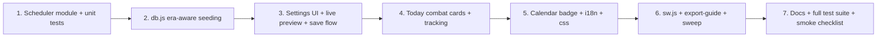

# FitUp Combat Integration Mode — Implementation Plan (v1)

**Goal**: Add a Settings-driven "Combat Training" mode: up to 3 combat days per week — 2 fixed external class days (user picks weekdays, e.g. Tue + Thu) + 1 auto-assigned home bag-practice day. When enabled, the app **re-arranges the repeating weekly program order optimally** (permutes which day-type lands on which weekday), while preserving one-off swap/skip flexibility and all history.

**Status**: Design approved pending user confirmation. No code written yet.

---

## 1. Current Architecture Facts (verified)

| Fact | Location | Consequence |
|---|---|---|
| Program is weekday-anchored: Sun=Rest, Mon=Legs+Core, Tue=Zone 2, Wed=Push, Thu=Active Recovery, Fri=Pull+Grip, Sat=VO2 Max | `generate_program.py` `generate_day_exercises(dow, week)` lines 966–1166, `START_DATE = 2026-07-06` (Monday) | A week block in `data.daily` = 7 consecutive entries ordered Mon..Sun (blockPos 0..6, blockPos = (jsDay + 6) % 7) |
| 560 pre-baked day objects (80 weeks × 7), week parity toggles / biceps microcycle / deload / unlock gates already baked into each object | `js/data.js` `window.TRAINING_DATA.daily` | Permuting **whole day objects within a week block** preserves ALL internal program logic — content travels with its day-type |
| PLAN store seeded from `data.daily`, dates = planStartDate + dayIndex; full clear + re-seed | `js/db.js` `loadTrainingPlan()` lines 235–318 | Permutation must be applied at seed time; dayIndex↔date mapping stays chronological |
| TRACKING keyed by dayIndex; PROGRESSION keyed by exercise | `js/db.js`, `js/progression.js` | Past weeks must NEVER be permuted (history integrity); future weeks have no tracking yet → safe to permute |
| One-off flexibility exists: `performSwap()` → `DB.swapWorkouts(a,b)` mutates PLAN records; skip buttons per exercise | `js/today.js` lines 3953–4023 | Must keep working on top of the permuted baseline; incremental re-seed (no clear of past) preserves past manual swaps |
| Settings live in SETTINGS store (`DB.setSetting/getSetting`), synced by CloudSync, included in JSON backup | `js/app.js`, `js/cloud-sync.js` | Combat config rides existing sync/backup for free |
| Day-type visuals centralized | `js/ui.js` `getDayTypeInfo()` lines 983–1026 | Single place to add combat badges |
| Nutrition cycling targets derived from dayType at render | `js/today.js` `getCyclingTargetsForDay()` | Automatically follows permuted content — no change needed |

---

## 2. Feature Design

### 2.1 Settings UI — new card "🥊 Combat Training / אימוני לחימה"

Placed in `index.html` settings-content section (after Language card):

- **Enable toggle** (off by default → zero behavior change when disabled)
- **Sport selector**: Muay Thai / Boxing / Kickboxing / Other → adjusts safety text on cards (clinch warning for Muay Thai, wrist emphasis for Boxing)
- **Class Day 1** + **Class Day 2**: weekday chip pickers (א׳–ש׳, JS getDay convention 0=Sun..6=Sat). Second class day optional (supports 1-class weeks)
- **Home practice**: `Auto` (default, system computes optimal day and displays it with reason) or `Off`
- **Hard class preference**: `Auto / First day / Second day` — which class day hosts the VO2-type slot (class replaces 4×4) vs Zone 2 slot (class stacks on treadmill). Auto = optimizer decides from spacing costs
- **Live preview grid**: 7-day mini calendar recomputed on every chip change — shows new weekday→day-type layout with 🥊 markers + optimizer warnings
- **Save** → confirm modal: "New weekly order takes effect from next Monday {date}. This week finishes as usual." → persists + re-seeds future weeks
- **Disable** → identity permutation from next week boundary (past permuted weeks stay as-trained)

### 2.2 Setting schema (SETTINGS store key `combatSchedule`)

```js
{
  rev: 2,                        // bumped on every save
  enabled: true,
  sport: 'muay_thai',            // muay_thai | boxing | kickboxing | other
  classDays: [2, 4],             // JS getDay: 0=Sun .. 6=Sat
  practice: 'auto',              // auto | off
  hardClass: 'auto',             // auto | first | second
  resolved: {                    // computed at save time by scheduler
    practiceDay: 6,
    permutation: [0,1,2,5,4,3,6],// blockPos -> baseOffset (see 2.3)
    hosts: { class1: 'zone2', class2: 'vo2', practice: 'recovery' },
    warnings: ['push_after_class', ...]
  },
  history: [                     // append-only eras, immutable once passed
    { from: 105, rev: 2, enabled: true, perm: [0,1,2,5,4,3,6],
      classDays: [2,4], practiceDay: 6, sport: 'muay_thai' }
  ]
}
```

**Era history is required**: a full re-seed (data version bump / Reload Plan button) rebuilds all 560 days from `data.daily`; each week block must be permuted with the era that was active at its start, so already-trained weeks reproduce byte-identical content and tracking stays consistent across multiple setting changes.

### 2.3 Scheduler module — new `js/combat-scheduler.js` (pure, deterministic, unit-testable)

Base week block offsets (position in `data.daily` week, 0=Mon..6=Sun):
`0=Legs, 1=Zone2, 2=Push, 3=ActiveRecovery, 4=Pull, 5=VO2Max, 6=Rest`

API:
```js
CombatScheduler.computeWeek({ classDays, practice, hardClass, baseDowAnchor })
  -> { practiceDay, permutation, hosts, warnings, score }
CombatScheduler.eraForDayIndex(combatSchedule, dayIndex) -> era|null
CombatScheduler.combatInfoForDay(combatSchedule, dayIndex, dateDow) -> null | { kind:'class1'|'class2'|'practice', hostType, guidanceKey }
```

**Algorithm**: brute-force candidate space (≤ 720 combos: 5 practice-day candidates × arrangements of {Zone2, VO2, Recovery} on 3 combat days × arrangements of {Legs, Push, Pull, Rest} on 4 free days), filter by hard constraints, score, pick minimum. Deterministic tie-break: fewest displaced positions → lexicographic permutation. Runs in microseconds; called live on every chip click for preview.

**Hard constraints**:
1. Class days and practice day never host strength day-types (Legs/Push/Pull) and never host Rest
2. Rest day never on a combat day
3. Bijection — every day-type used exactly once per week

**Soft costs** (derived from the interference analysis agreed with the user):

| Situation | Cost | Rationale |
|---|---|---|
| Push day immediately after a class day (cyclic) | +3 | shoulder/triceps fatigue affects pressing |
| Pull day immediately after a class day | +2 | grip/forearm fatigue |
| Legs day immediately after a class day | +1 | stance/footwork calves |
| Pull day immediately after practice day | +3 | wrist/grip before towel hang & pull-ups |
| Push day immediately after practice day | +2 | wrists/shoulders |
| Any strength day immediately before a class day | +1 | energy/time pressure |
| Two strength days on consecutive weekdays (cyclic) | +2 per pair | spacing loss |
| Legs immediately after VO2-type day | +2 | heavy legs after intervals |
| Rest not immediately before Legs day | +1 | original recovery→legs pattern |
| Full class hosted on Recovery slot | +1 | recovery erosion |
| Practice hosted on Zone2 slot | +1 / on VO2 slot | +2 | bag stacks worst on hard interval day |
| Practice day cyclically adjacent to a class day | +1 | motor learning prefers distributed practice |
| Class days adjacent to each other | +2 | warning only (user-fixed input) |
| Each position displaced from identity | +0.5 | stability — minimal reshuffle |

**Golden case (validated by hand)**: classes Tue+Thu → `permutation = [0,1,2,5,4,3,6]`, practiceDay=Sat:
Mon Legs · Tue Zone2+Class1 · Wed Push · Thu VO2+Class2 · Fri Pull · Sat Recovery+Bag · Sun Rest. Only Thu↔Sat swap — matches the advisory given to the user exactly.

### 2.4 Plan seeding — `js/db.js`

- `loadTrainingPlan()` (full re-seed path): for each week block `k`, resolve era via `history` (last era with `from <= 7k`); if era enabled → `source = data.daily[7k + perm[pos]]` else identity. Then overwrite `dayIndex/dayNum/date/dayOfWeek` from the chronological position, recompute `workoutSeq/restSeq` in chronological order. Store `planMeta = { combatRev }` marker record.
- New `applyCombatSchedule()` (incremental path used on Save): **no clear** — rewrites only PLAN records with `dayIndex >= boundary` (boundary = next week-block start = next Monday; `0` for not-started users), using the new era. Past records (including past manual swaps) untouched.
- Boundary rule: `boundary = ceil((todayIndex + 1) / 7) * 7`. Mid-week activation never produces duplicate/missing day-types inside the transition week.

### 2.5 Today page — combat cards (`js/today.js`)

Rendered when `combatInfoForDay()` returns non-null for the displayed dayIndex:

| Host day-type under the card | Guidance shown (i18n key) |
|---|---|
| Zone 2 + class | `combat_guidance_zone2`: class first (fresh CNS for technique) → then treadmill; full 45m if possible, 25–30m floor on tight days |
| VO2 Max + class | `combat_guidance_vo2`: hard class **replaces** the 4×4 — pad rounds are the interval stimulus; or 4×4 morning + technique-only class evening, 6h apart; never both at full intensity |
| Active Recovery + practice | `combat_guidance_practice`: 15–20 min LIGHT technique bag only, no power; keep the walk + neck protocol + mobility; wraps + gloves mandatory |
| Strength day-type (only possible after a manual swap) | `combat_warning_strength_host`: interference warning — keep class technique-only |
| Any, during deload week / auto-deload | `combat_deload_note`: technique only, no hard rounds, no sparring |

Card anatomy: 🥊 header + sport label + host guidance + safety footer (no clinch / disc stop-conditions / wraps rule — sport-adjusted) + actions:
- **Class days**: `Mark class done` + optional RPE 1–10 + notes → stored in `tracking.combat = { done, skipped, rpe, notes, ts }`; also `Skip` (missed class, zero penalty)
- **Practice day**: `Mark practice done` / `Skip practice` (explicitly optional — "not always but possible")
- Combat completion does NOT alter the set-based progress circle or progression engine (program content remains the prescriptive core); calorie estimate adds a cardio-class constant (≈350 kcal scale, weight-adjusted) when done.

**Transition banner**: when setting saved mid-week → banner on Today until boundary: "New combat schedule starts Monday {date}".

### 2.6 Surrounding surfaces

- `js/calendar.js`: 🥊 badge on combat days (via `combatInfoForDay`), class vs practice icon variants
- `js/ui.js` `getDayTypeInfo()`: unchanged day-types (content keeps its identity); combat badge is an overlay, not a new day-type
- `js/i18n.js`: ~30 new keys × en/he/ar (card titles, guidance matrix, warnings, settings labels, weekday chips, confirm modal, banner)
- `css/main.css` or `css/components.css`: combat card style (distinct accent border, e.g. red/gold gradient), weekday chips, preview grid
- `sw.js`: add `js/combat-scheduler.js` to precache + bump cache version
- `index.html`: `<script src="js/combat-scheduler.js">` before db.js/app.js
- `js/export-guide.js`: apply era permutation + annotate combat days in the exported 80-week guide
- Sweep at implementation: grep all `TRAINING_DATA.daily` consumers (export-guide, gemini, stats, notifications) to confirm they read the PLAN store or apply eras

### 2.7 Compatibility guarantees

| Existing feature | Impact |
|---|---|
| Swap / skip (one-off flexibility) | Fully preserved — operates on permuted PLAN records; incremental re-seed never clears past |
| Progression engine, softened gate, auto-deload | Untouched — keyed by exercise/session outcomes; each day-type still occurs exactly 1×/week |
| Week parity toggles, biceps 3:1 microcycle, arm-block exposure limit, deload weeks | Baked into day objects → travel with permutation |
| Nutrition cycling banners | Derived from dayType at render → follows content automatically |
| Tracking history / stats / photos / XP | dayIndex↔date unchanged; past weeks never permuted |
| Cloud sync / backup-restore | setting + era history ride existing SETTINGS sync; boot-time `combatRev` vs `planMeta` mismatch → auto re-seed |
| Data version bump re-seed (v15.x migrations) | Era history replays correct permutation per week block |
| Combat disabled later | Identity era appended from next boundary; trained weeks stay as-trained |

### 2.8 Edge cases

- **1 class day only**: optimizer places it on best cardio host; remaining cardio/recovery days stay near-identity
- **Adjacent class days (e.g. Sun+Mon)**: feasible (Recovery can host a class at +1 cost); warning shown
- **Class day on current Rest weekday (Sun)**: Rest relocates; warning "protect sleep & recovery"
- **User changes course days mid-program**: new era from next Monday; weeks in between keep old layout
- **Not-started user (no planStartDate)**: boundary = 0, permutation from Day 1
- **Mid-week Save**: current week finishes old layout; banner communicates boundary
- **Swap puts strength on a combat weekday**: card switches to interference-warning variant (2.5)

### 2.9 Out of scope (v1)

- Automatic sparring-phase periodization (technique→pads→sparring over months) — safety text is static per sport
- Combat XP / streak gamification, Google Fit combat export
- Coach-side class content programming (app logs attendance + guidance only)

---

## 3. File-by-File Change List

| File | Change |
|---|---|
| `js/combat-scheduler.js` | NEW — pure optimizer + era helpers (2.3) |
| `js/db.js` | era-aware `loadTrainingPlan()`; new `applyCombatSchedule()` incremental re-seed; `planMeta.combatRev`; export both |
| `index.html` | combat settings card markup + script tag |
| `js/app.js` | settings wiring: chips, live preview, save/disable flow (confirm modal → setSetting → applyCombatSchedule → CloudSync.scheduleSync → toast), boot rev-check |
| `js/today.js` | combat card render + tracking.combat actions + transition banner + strength-host warning |
| `js/calendar.js` | 🥊 badges |
| `js/i18n.js` | new keys ×3 languages |
| `css/components.css` (or main.css) | combat card / chips / preview styles |
| `sw.js` | precache new file + version bump |
| `js/export-guide.js` | era-aware guide export + combat annotations |
| `tests/combat-scheduler.test.js` | NEW — see §5 |
| `PROGRAM_GUIDE.md` | Appendix C — Combat Integration Mode |
| `README.md` | feature bullet |

## 4. Implementation Order



## 5. Test Plan

- `tests/combat-scheduler.test.js`:
  - Golden case Tue+Thu → perm `[0,1,2,5,4,3,6]`, practice Sat, hosts zone2/vo2/recovery
  - Exhaustive sweep: all 21 class-day pairs × practice auto/off → hard constraints never violated, deterministic output (run twice → identical)
  - Adjacent-pair warning emitted; Sunday-class Rest-relocation valid
  - 1-class-day mode valid
- Seeding tests (extend `tests/` node harness): era boundary — blocks before `from` identity, blocks after permuted; double-save creates 2 eras and full re-seed reproduces both layouts; disable restores identity from boundary
- Regression: existing suite (`make test`) green — deload, biceps microcycle, features 8-5-3-2-1, preloader
- Manual smoke checklist: enable mid-week → banner → Monday layout changed → class card actions log to tracking → swap still works → calendar badges → backup/restore round-trip → disable restores

## 6. Risks & Mitigations

| Risk | Mitigation |
|---|---|
| Full re-seed paths forget eras → history mismatch | Single era-resolution helper used by BOTH seeding paths; test covers version-bump re-seed |
| Permutation confuses "Day N/7" labels | Card header shows weekday name + day-type label; program-day number secondary |
| `isNewExercise` / prev-day comparisons see new neighbors after boundary | Cosmetic only; verify badges in smoke test |
| Notifications reference weekday assumptions | Sweep `js/notifications.js` during step 6 |
| User expects instant mid-week change | Confirm modal + banner state the next-Monday boundary explicitly |
