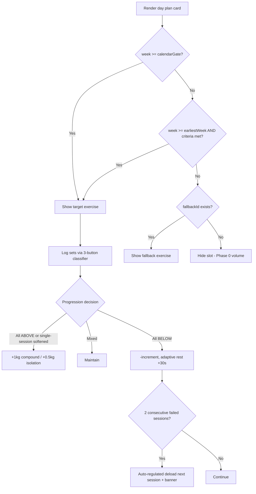

# FitUp v15.7 Accelerated — Program Optimization Plan

**Goal**: Make training results appear faster while keeping (and in some areas improving) correctness and safety. Strategy chosen: **Balanced Acceleration**.

---

## 1. Verdict — Is the "too slow" feeling justified?

**Yes, partially.** Evidence from the codebase:

| # | Finding | Location | Impact on speed of results |
|---|---------|----------|---------------------------|
| 1 | Weeks 1–4 lock almost all meaningful exercises (calendar-based) | `generate_program.py` `generate_day_exercises()` week gates | Real stimulus starts only at Week 5 |
| 2 | Arm Block myo-reps locked until Week 10 despite "Prominent Arms" being a primary goal | `generate_program.py:1049,1103`, `progressionSettings.armBlock.enabledFromWeek` | Arm specialization delayed 2.5 months |
| 3 | Progression requires ALL sets ABOVE, or two consecutive near-perfect sessions (softened) | `js/progression.js` `checkSoftenedProgression()` | +1kg every 2–4 weeks per exercise — ~2× slower than needed |
| 4 | 1kg increment on 3kg-start isolations = 33% jump → stall/oscillation trap (fail window → demote → repeat) | catalog: lateral raise, curls | Weeks wasted at same weight |
| 5 | Biceps progression frozen every 3rd week (2:1 microcycle) | `getBicepsMicrocycleWeek()` | Biceps progress at ~66% speed |
| 6 | Deload every 8 weeks = 12.5% of program with zero progression | `DELOAD_WEEKS`, `deloadEveryWeeks: 8` | 10 non-progressing weeks over 80 |
| 7 | Hidden inconsistencies: hardcoded `% 8` deload in `getDisplayPrescription()` (js/progression.js:529), hardcoded `% 3` biceps cycle in `isPairActive()` (js/progression.js:326), `targetReps` unlock criteria defined in data but never evaluated by `checkUnlockCriteria()` | `js/progression.js` | Correctness bugs — settings changes wouldn't propagate |

**What is justified and stays**: lumbar-disc safety rules, stop conditions, neutral-spine rules, push-up bars rule, time-decay guard (10 days), tendon-adaptation floor weeks, and the biological reality that visible hypertrophy needs 8–12 weeks minimum.

**Note on current position**: Program start `2026-07-06` → user is at ~Week 13 today. They lived through 4 ramp weeks + Week-8 deload; Arm Block only activated at Week 10. The frustration matches the structure exactly.

---

## 2. Design Decisions (v15.6 Lean → v15.7 Accelerated)

| Parameter | Current v15.6 | New v15.7 | Expected gain |
|---|---|---|---|
| Phase 0 graduation | Calendar Week 5 | **Performance-based** unlocks with earliest-week safety floors (see §3) | Capable users graduate 1–2 weeks earlier; nobody graduates later than calendar |
| Arm Block activation | Week 10 | **Week 6** + performance gate (curl ≥ 12 clean reps, no elbow-pain flags) | 4 extra weeks of arm specialization per cycle |
| Pallof Press | Week 10 | Week 6 + dead-bug stage gate | Earlier anti-rotation core strength (lumbar support) |
| Softened progression | Two-session gate (current ≥ max−1 AND previous all-max) | **Single-session gate**: all sets in_window, all reps ≥ max−1, no mechanical stop, ≤10-day gap | ~2× faster load progression |
| Isolation increments | 1kg (3→4kg = 33% jump) | **0.5kg** for lateral raise, curls, hammer curls, arm blocks, OH triceps ext; `legalWeights` gains 0.5 steps | Removes stall/oscillation trap |
| Deload frequency | Every 8 weeks (weeks 8,16,…80 = 10 deloads) | **Every 12 weeks** (weeks 12,24,36,48,60,72 = 6 deloads) **+ auto-regulated early trigger** | +4 productive weeks per year, with a smarter safety net |
| Auto-regulated deload | None | 2 consecutive sessions with ≥2 main compounds all-BELOW, OR ≥3 weight demotions in 7 days, OR repeated joint-pain flags → next session runs deload mode + banner | New safety feature that did not exist before |
| Biceps microcycle | 2 heavy : 1 light (freeze every 3rd week) | **3 heavy : 1 light** (freeze every 4th week) | Biceps progress at 75% speed instead of 66%, elbow protection retained |
| Session duration | 40–45 min | Unchanged (~45–50 max) | No time cost |

**Non-goals** (explicitly out of scope for Balanced): weekly volume increases (chest/quads/hamstrings sets stay as-is), RPE increases, Phase 0 shortening to 2 weeks.

---

## 3. Performance-Based Unlock Architecture

**Core rule — "Calendar ceiling, performance accelerator":**

```
unlocked = (week >= calendarGate)  OR  (week >= earliestWeek AND performanceCriteriaMet)
```

An exercise is **never later** than the old calendar gate (protects mid-program users and guarantees no regression), but can be **earlier** when performance proves readiness. `earliestWeek` is a hard connective-tissue safety floor.

### Proposed criteria table (thresholds validated during implementation)

| Exercise | earliestWeek | Old gate | Performance criteria | While locked |
|---|---|---|---|---|
| Goblet BSS | 3 | W5 | Heels-elevated goblet squat ≥ 10kg | hidden (Phase 0 volume) |
| Suitcase Carry | 4 | W5 | Goblet RDL ≥ 10kg AND dead-bug stage ≥ 1 | hidden |
| Calf block (2 ex) | 3 | W5 | none (low risk) — floor only | hidden |
| Single-Arm Seated OHP | 3 | W5 | Push-up progression ≥ 10 reps | hidden |
| Pike Progression | 3 | W5 | Push-up progression ≥ 10 reps | hidden |
| Single-Arm Lateral Raise | 3 | W5 | none (3kg start) — floor only | hidden |
| DB OH Triceps Ext | 3 | W5 | Push-up progression ≥ 10 reps | hidden |
| Single-Arm Hammer Curl | 3 | W5 | Single-arm curl ≥ 12 reps | hidden |
| Towel Hang / Tuck L-Sit | 3 | W5 | Dead hang 15s / dead-bug stage ≥ 1 | hidden |
| Hollow Body Hold | 3 | W5 | Dead bug ≥ 16 reps | hidden |
| Push-Up Volume (Day 5) | 3 | W5 | Push-up progression ≥ 10 flat reps | hidden |
| Pallof Press | 6 | W10 | Dead-bug stage ≥ 2 | hidden |
| Arm Blocks (3) | 6 | W10 | Corresponding lift ≥ 12 clean reps AND no elbow/shoulder pain flags | hidden |
| Zone 2 (Brisk Walking) | 3 | W5 | ≥4 relaxed-walk sessions completed | relaxed walk shown |
| VO2 Max 4x4 | 4 | W5 | ≥2 Zone-2 sessions completed | relaxed walk shown |
| Deep Mobility Protocol | 3 | W5 | none — floor only | micro mobility shown |

### Runtime mechanism (mostly existing)

- `checkUnlockCriteria()` in `js/progression.js` already supports `targetWeightKg` / `targetStageIndex`; **extend** with `targetReps` (data already uses it for feet-elevated push-up — currently silently ignored = bug), `earliestWeek`, `calendarGate`, and session-count criteria.
- `js/today.js` (line ~172) already swaps locked exercises to a fallback; **extend** to honor an explicit `fallbackId` field and to hide the card when `fallbackId: null`.
- Pair/circuit/block dissolution on inactive member already exists (`dissolveIfMemberInactive: true`).



---

## 4. Migration Plan (user is mid-program at ~Week 13)

1. `generate_program.py` regenerates `js/data.js` with version `15.7 Accelerated`; `START_DATE` unchanged so all 560 day-indexes keep their dates.
2. `js/db.js`: bump `v15LeanSchemaVersion` from `15.6.2` → `15.7.0` (3 occurrences). Existing `ensureV15LeanSchema()` detects mismatch → `loadTrainingPlan()` re-seeds PLAN store.
3. **Preserved automatically**: TRACKING (keyed by dayIndex), PROGRESSION_STATE (current weights/stages), photos, nutrition, settings, XP. `DB_VERSION` stays 9 — no store schema changes (auto-deload flag lives in SETTINGS store).
4. Week-13 user effect: all gates ≤ W13 unlock immediately via calendar ceiling; next calendar deload moves from W16 → W24; biceps cycle recomputes (W13 = heavy in both schemes); softened gate + 0.5kg increments apply from next session.
5. `planStartDate` setting untouched — day indexing continuity preserved.

---

## 5. File-by-File Change List

| File | Changes |
|---|---|
| `generate_program.py` | `DELOAD_WEEKS = range(12, 81, 12)`; arm-block/pallof gates W10→W6; biceps `% 3`→`% 4` (light = position 4); catalog: `increment: 0.5` for 5 isolation entries, add `earliestWeek` + `unlockCriteria` + `fallbackId` + `calendarGate` to gated entries; emit full-suite days from Week 1 with unlock metadata (hidden-when-locked reproduces Phase 0); `progressionSettings`: `deloadEveryWeeks: 12`, `armBlock.enabledFromWeek: 6`, `bicepsMicrocycle.cycleLength: 4 / heavyWeeks [1,2,3] / lightWeeks [4]`, `legalWeights` with 0.5 steps, `softenedProgression.requirePreviousSessionAllMax: false`, new `autoDeload` config block; version → `15.7 Accelerated` |
| `js/data.js` + `training_data.json` | Regenerated via `python3 generate_program.py` |
| `js/progression.js` | `checkSoftenedProgression()`: drop previous-session condition (keep time-decay); `checkUnlockCriteria()`: add `targetReps`, `earliestWeek`, `calendarGate`, session-count support; `getBicepsMicrocycleWeek()`: cycle 4; `isPairActive()`: use `bicepsMicrocycle.cycleLength` instead of hardcoded 3; `getDisplayPrescription()`: use `deloadEveryWeeks` setting instead of hardcoded 8; `isArmBlockAllowed()`: week 6 floor; new `checkAutoDeloadTrigger(history)`; 0.5kg-safe rounding in decisions |
| `js/today.js` | `fallbackId` swap/hide rendering; auto-deload banner + deload-mode session behavior (sets ceiling 2, no progression, pairs dissolved); unlock-reason display. **Note: file was recently modified — re-read before editing** |
| `js/exercises.js` | Skill-tree `unlockWeek` updates: Arm Blocks 10→6, Pallof 10→6, Deep Mobility 5→3, BSS/calf/carry/OHP/lateral/hammer/towel/L-sit/hollow/pike/push-up-volume 5→3, Brisk Walking 5→3, VO2 Max 5→4; new `unlockCond` i18n keys for performance gates |
| `js/db.js` | Schema version bump `15.6.2`→`15.7.0` (comparison + 2 setters); export `schemaVersion`/`version` → 15.7 |
| `js/i18n.js` | New keys (en/he/ar): auto-deload banner, performance-unlock reasons, updated week badges |
| `PROGRAM_GUIDE.md` | v15.7: §1.2 softened-progression rule, §2.3 biceps 3:1, §3.0 performance-based Phase 0 + graduation, §3.2 cardio gates, Part 5 deload-every-12 + auto-regulated, Appendix A arm block W6, Appendix B version refs |
| `README.md` | Feature descriptions: deload cadence, arm block week, microcycle, micro-loading, performance unlocks |
| `tests/*` | `biceps-microcycle.test.js` (cycle 4), `deload.test.js` (12-week + auto trigger), `progression.test.js` (single-session softened, 0.5 increments, targetReps), `program-integrity.test.js`, `check.py`, `check_mismatches.py`, `deep_audit.js`, `full_system_audit.js`, `microscopic_audit.js`, `ultra_deep_audit.js` — update expected constants; run `make test` |
| Sweep | Grep for stale `% 8`, `week >= 10`, `enabledFromWeek`, `15.6`, `Week 10` across `js/` (incl. `export-guide.js`, `stats.js`, `calendar.js`, `app.js`, `ui.js`) |

---

## 6. Implementation Order


Rationale: engine-first because generator output references engine semantics; quick wins (softened gate, micro-loading, deload cadence, biceps 3:1, arm block W6) land in steps 1–3 even if the performance-unlock restructure (step 2b) needs iteration.

---

## 7. Risks & Mitigations

| Risk | Mitigation |
|---|---|
| Mid-program user sees changed day content after re-seed | Calendar-ceiling rule guarantees everything ≤ W13 stays unlocked; tracking history untouched (dayIndex keys) |
| Performance criteria too strict → nothing unlocks early | Criteria are OR-ed with calendar gate; earliestWeek floors are the only hard constraint; thresholds validated against real progression states during implementation |
| 0.5kg increments conflict with integer assumptions (parsing, rounding, UI weight pickers) | Sweep `parseInt` on weights → `parseFloat`; `legalWeights` includes 0.5 steps; deload −2kg still lands on legal grid |
| Auto-deload false positives interrupt momentum | Trigger requires 2 consecutive failed sessions or 3 demotions/7 days; affects exactly one session; visible banner explains why |
| Tendon/elbow risk from earlier Arm Block | W6 floor + curl performance gate + existing pain-flag cancellation + weekly exposure limit unchanged |
| Hidden hardcodes missed (e.g., `% 8`, `% 3`) | Dedicated sweep step + audit scripts updated to assert settings-driven behavior |
| `js/today.js` recently edited outside this task | Re-read file immediately before any modification |

---

## 8. Expected Outcome

- **Strength**: ~2× faster load progression (single-session softened gate + micro-loading removes isolation stalls).
- **Arms**: specialization from Week 6 instead of 10 + 3:1 microcycle → visible arm development roughly 4–6 weeks earlier.
- **Net stimulus**: 74 productive weeks vs 70 over the program (+~6%), plus possible 1–2-week early Phase 0 graduation.
- **Correctness**: 3 latent engine bugs fixed (hardcoded deload modulo, hardcoded biceps modulo, ignored `targetReps` criteria); new auto-regulated deload adds a safety net the old program lacked.
- **Safety**: all iron rules, stop conditions, lumbar protections, and time-decay guards preserved; earliest-week floors keep connective-tissue adaptation intact.
